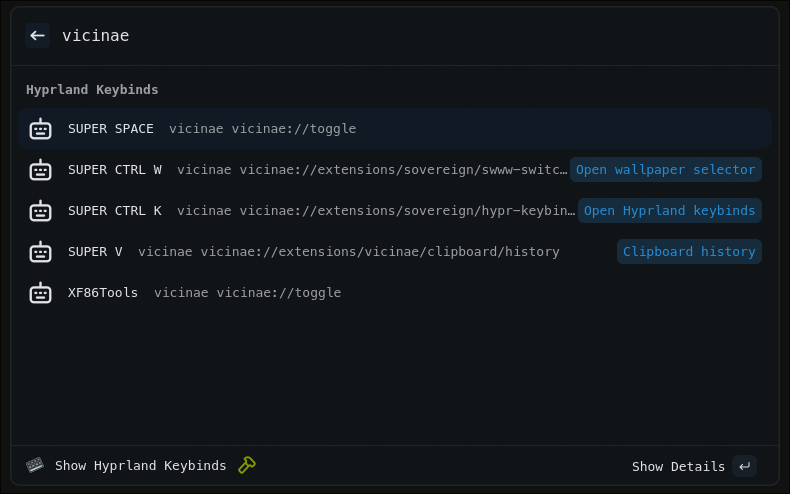
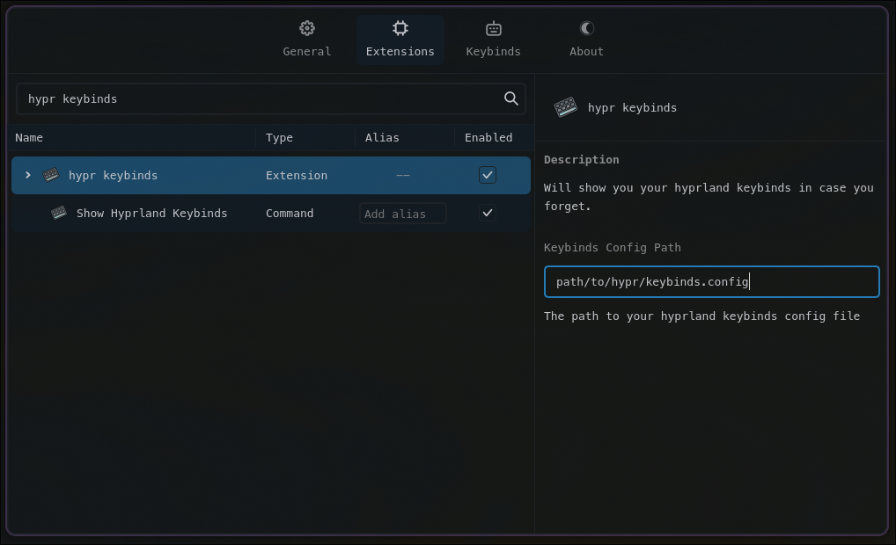

# Hyprland Keybinds (Vicinae Extension)

Look at what your binds are in a hyprland config file.

## Features

- Display your keybinds from a single config file in a list with sweet detail!

## Requirements

- Linux with Hyprland
- [vicinae](https://github.com/vicinaehq/vicinae)

## Commands

- `Show Hyprland Keybinds` — List your hyprland keybinds.

## Extension Preferences

- `Keybinds Config Path` — The path to your hyprland keybinds config file.
